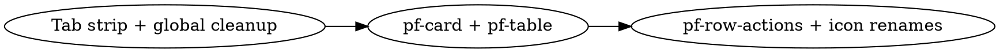

# UI Redesign — Right-Pane Read-Only Content

**Date:** 2026-05-11
**Branch:** `feature/ui-redesign-rightpane` (off `feature/ui-redesign-treeview`)
**Status:** Design
**Sub-project:** 3 of 4 (right-pane content; preceded by foundation + treeview, followed by entity forms)

---

## 1. Background

The editor's right pane is a dynamic tab container (`#editortabs`) populated
at runtime by `assets/js/dynamic-tabs.js`. Each tab corresponds to an opened
component type and renders `rightframe.componenttype.template` — a four-column
grid containing five read-only tables (Properties, PHP events, Database
events, GUI events, Methods) plus an entity-editor form column.

After sub-projects 1 and 2, three pieces still wear their legacy BS3-era look:

- The right-pane tab strip (`<ul id="editortabs" class="nav nav-tabs">`)
  carries the legacy `.nav-tabs .nav-link.active { color:#fff;
  background-color:#8cb0cb }` global rule — the chunky blue-block style. The
  left-pane tab strip already switched to `.pf-tabs` (offsite-blue underline)
  in sub-project 1; the global rule was kept alive only because this
  right-pane consumer existed.
- The five tables (`<table class="table table-condensed">`) use the BS3
  `table-condensed` class and have no row striping, hover affordance, or
  selection style.
- The row-action buttons (`<button class="btn btn-default btn-sm pull-right">`)
  use BS3 idioms. They live in `rightframe.property.item.template`,
  `rightframe.event.item.template`, `rightframe.method.item.template`, and
  the three "+ Add new property/event/method" + one Refresh button in
  `rightframe.componenttype.template`.

Section titles inside each column are bare `<p class="title">…</p>` paragraphs
with a grey-block background — visually disconnected from the table beneath
them.

This sub-project ports the right-pane visual language to match the sibling
builder app and brings the editor's read-only content into a consistent
**card-per-section** structure with the dropdown picker moved into each
section's card header.

## 2. Scope

**In scope**

- Right-pane tab strip migrated to `.pf-tabs` (single class addition).
- Delete the legacy `.nav-tabs .nav-link` and `.nav-tabs .nav-link.active`
  global CSS overrides — no consumer remains after this sub-project.
- New `.pf-card` rule block — Bootstrap card wrapper for each
  Properties/Events/Methods/Editor section. Ported from builder's `.wiz-card`
  pattern. Header carries the section title + icon (offsite-blue) and the
  "Add new X" picker on the right; body holds the read-only table.
- New `.pf-table` rule block — light-gray header, alternating row stripes,
  offsite-green hover/select tint, mandatory rows bold, disabled rows dim.
- New `.pf-row-actions` rule block — small grouped icon buttons with neutral
  border and hover lighten.
- New `.pf-add-row` rule block — the dropdown + plus-button picker that sits
  in each card header.
- Apply `pf-card` + `pf-table` + `pf-row-actions` + `pf-add-row` classes
  across `rightframe.componenttype.template`, `rightframe.property.item.template`,
  `rightframe.event.item.template`, and `rightframe.method.item.template`.
- Swap `table-condensed` (BS3) → `table-sm` (BS5) on the five tables.
- Replace the six section-header `<p class="title">` paragraphs (Properties,
  PHP events, Database events, GUI events, Methods, Editor) with proper
  `.card-header h5.pf-card-title` headings carrying section icons.
- Modernize icon names on touched buttons:
  - `fa-trash` → `fa-trash-can`
  - `fa-plus-square` → `fa-square-plus`
  - `fa-refresh` → `fa-arrows-rotate`
- Re-scope the `tr.prop_disabled` and `td.prop_mandatory` rules as
  `.pf-table tr.prop_mandatory td` / `.pf-table tr.prop_disabled td` so
  they compose with the new row stripes.

**Out of scope (deferred to sub-project 4)**

- `rightframe.form.componenttype.template`, `rightframe.form.event.template`,
  `rightframe.form.method.template`, `rightframe.form.property.template` —
  the entity-edit forms inside the Editor card's body.
- BS3 shim removal (`.btn-default`, `.btn-xs`, `.pull-right`, `.well`,
  `.well-sm`) — these stay because the sub-project 4 form templates still
  consume them. Removed when sub-project 4 lands.
- The `componentData_container` four-column grid layout — the column shapes
  stay, only the section contents inside each column change.
- Search-results rendering and the legacy `searchApp()` flow (touches only
  the left pane via `#search_result_tree`).

**No changes to**

- `src/TholosEditor/*` (no PHP changes).
- `assets/js/dynamic-tabs.js` — verified preserves the `<ul>`'s pre-existing
  class list when appending tabs. The `pf-tabs` class added in `rightframe.main.template`
  carries through automatically.
- `assets/js/TholosEditor.js` (no JS handler changes).
- The three `rightframe.*.ancestor.template` templates — they render plain
  text and don't carry classes that conflict.

## 3. Architecture

### 3.1 Three-commit progression



The order matters because:

1. The tab strip change is independent and removes the global `.nav-tabs`
   override. After step 1, the right pane's tab strip matches the left
   pane's; the section contents inside still look legacy.
2. Cards + tables land together because the new section layout *requires*
   the card wrapper to host the dropdown picker that the legacy markup put
   above each table. Splitting them would leave a commit in a visually
   incoherent state.
3. Row buttons modernize last because they're a deeper template change and
   the icon renames are easy to verify against a fully-styled card body.

### 3.2 `.pf-card` — section wrapper

Each section in the right pane (Properties, PHP events, Database events,
GUI events, Methods, Editor) becomes:

```html
<div class="pf-card">
  <div class="card-header">
    <h5 class="pf-card-title">
      <i class="fa-regular fa-rectangle-list"></i>Properties
    </h5>
    <div class="pf-add-row">
      <select class="form-select form-select-sm" id="newPropertyID">
        <option value="">* New property…</option>
        <!-- SQL-driven options -->
      </select>
      <button class="btn" type="button"
              onclick="if (…) addNewProperty(…); else addProperty(…);"
              title="Add new property">
        <i class="fa-regular fa-square-plus"></i>
      </button>
    </div>
  </div>
  <div class="card-body">
    <table class="table table-sm pf-table">
      <!-- thead + tbody (rows from *.item template) -->
    </table>
  </div>
</div>
```

Card-header icon per section:

| Section | Icon |
|---|---|
| Properties | `fa-regular fa-rectangle-list` |
| PHP events | `fa-regular fa-code` |
| Database events | `fa-regular fa-database` |
| GUI events | `fa-regular fa-display` |
| Methods | `fa-regular fa-code-branch` |
| Editor | `fa-regular fa-pen-to-square` |

### 3.3 `.pf-table` — table styles

Ported from builder spec §3.2 with the following editor-specific adaptations:

- Editor has no `tr.is-selected` row state today, but the rule is included so
  it works when sub-projects 3/4 wire selection later.
- `tr.prop_disabled` and `td.prop_mandatory` already exist in editor and are
  re-scoped under `.pf-table` so they compose with the new stripes.
- The `prop_toggles` first column in the Properties table (the four toggle
  icons — disable, mandatory, runtime, no-hidden-data) gets a dedicated rule
  to remove default link colors and provide a hover affordance.

### 3.4 `.pf-row-actions` — row action buttons

Ported from builder spec §3.4. Used in:

- `rightframe.property.item.template` — Remove + Default-value buttons.
- `rightframe.event.item.template` — Remove button.
- `rightframe.method.item.template` — Remove button.

Each row's action buttons get wrapped:

```html
<td class="text-right" nowrap>
  <span class="pf-row-actions">
    <button class="btn" onclick="removeProperty(…)" title="Remove">
      <i class="fa-regular fa-trash-can"></i>
    </button>
    <button class="btn" onclick="defaultValueProperty(…)" title="Default value">
      <i class="fa-regular fa-at"></i>
    </button>
  </span>
</td>
```

The legacy `btn-default btn-sm pull-right` classes are dropped from each
button — `.pf-row-actions .btn` handles size, color, and grouping.

### 3.5 `.pf-add-row` — header picker

Sits in the right side of each `.card-header`. Compact (24px tall) so the
header stays ~36px total. Layout:

```html
<div class="pf-add-row">
  <select class="form-select form-select-sm">…</select>
  <button class="btn">…</button>
</div>
```

The select grows to fill space (`flex: 1 1 auto`); the button stays
intrinsic width. Max-width caps the picker at 200px so it never pushes the
title text into truncation.

### 3.6 Why the global `.nav-tabs` override can finally go

Sub-project 1 deliberately preserved:

```css
.nav-tabs .nav-link        { color: #337ab7; }
.nav-tabs .nav-link.active { color: #fff; background-color: #8cb0cb; }
```

because the right pane's `#editortabs` still consumed them. After this
sub-project adds `pf-tabs` to `#editortabs`, both nav-tabs strips in the app
use `.pf-tabs`. The legacy global rules become unreachable and are deleted.

## 4. Visual specification

### 4.1 `.pf-card`

| Property | Value |
|---|---|
| Background | `var(--te-surface)` |
| Border | `1px solid var(--te-border)` |
| Border-radius | `.35rem` |
| Margin-bottom | `10px` (so stacked cards in the Events column space cleanly) |
| Overflow | `hidden` (so the table's own border-radius isn't needed) |

### 4.2 `.pf-card .card-header`

| Property | Value |
|---|---|
| Background | `var(--te-pane-bg)` |
| Border-bottom | `1px solid var(--te-border)` |
| Padding | `.35rem .55rem` |
| Layout | `display: flex; align-items: center; gap: .5rem;` |

`.pf-card-title` (the `<h5>` inside the header):

| Property | Value |
|---|---|
| Font | 12px, weight 600 |
| Color | `var(--te-primary)` |
| Margin | `0` |
| Layout | flex with `gap: .4rem` to space the icon from the label |

The leading `<i>`/`<svg>` icon inherits `color: var(--te-primary)` so the
icon + label read as one unit.

### 4.3 `.pf-card .card-body`

| Property | Value |
|---|---|
| Padding | `0` (table fills edge-to-edge) |

The table inside has its first `<thead>` cell left-padded `.55rem` so the
header text doesn't crowd the card's left edge. The last `<tbody>` row drops
its bottom border so the table flush against the card's bottom edge.

### 4.4 `.pf-table`

| Property | Value |
|---|---|
| Font | 12px |
| Margin | `0` |
| Layout | `table-layout: fixed; border-collapse: collapse; width: 100%` |
| Header | bg `#e9ecef`, color `#495057`, weight 600, padding `.35rem .55rem`, bottom border `var(--te-border)` |
| Body row padding | `.25rem .55rem` |
| Odd row bg | `var(--te-surface)` |
| Even row bg | `var(--te-pane-bg)` |
| Row hover | `var(--te-success-tint-hover)` |
| Row selected (`is-selected`) | bg `var(--te-success-tint-select)`, inset 2px left border `var(--te-success)` |
| `tr.prop_mandatory td` | weight 600 |
| `tr.prop_disabled td` | color `var(--te-text-dim)` |

The `prop_toggles` first column (Properties only):

| Property | Value |
|---|---|
| Selector | `.pf-table .prop_toggles` |
| Layout | `white-space: nowrap` |
| Link color | `var(--te-text)` (was inherit) |
| Link hover | `var(--te-primary)` |
| Padding per icon | `0 2px` |

### 4.5 `.pf-row-actions`

| Property | Value |
|---|---|
| Float | `right` |
| Layout | `display: inline-flex; gap: .15rem; margin-left: .35rem;` |
| Button padding | `.1rem .4rem` |
| Button font | `11px` |
| Button color | `var(--te-text-muted)` on `var(--te-surface)` with `1px solid var(--te-border)` |
| Button hover | bg `#e9ecef`, border `#ced4da`, color `var(--te-text)` |

### 4.6 `.pf-add-row`

| Property | Value |
|---|---|
| Layout | `display: flex; gap: .25rem; align-items: center; max-width: 200px; margin-left: auto;` |
| Select | font 11px, height 24px, border `var(--te-border)`, flex-grow |
| Button | font 11px, height 24px, same border/color treatment as `.pf-row-actions .btn` |

## 5. Files changed

| File | Change |
|---|---|
| `assets/templates/tholoseditor/rightframe.main.template` | Add `pf-tabs` to `<ul id="editortabs" class="nav nav-tabs">`. |
| `assets/templates/tholoseditor/rightframe.componenttype.template` | Wrap each of the four column contents in a `.pf-card` structure: card-header with title + icon + `.pf-add-row` picker on the right, card-body holding the existing `<%FUNC%>`/`<%SQL%>` block + `.pf-table` rendered rows. Replace the three `<p class="title">` headings with `<h5 class="pf-card-title">` inside their card-header. Replace `table table-condensed` → `table table-sm pf-table` on the five tables. Wrap row-action buttons in `<span class="pf-row-actions">` and drop the legacy `btn-default btn-sm pull-right` classes. Modernize icon names (`fa-trash` → `fa-trash-can`, `fa-plus-square` → `fa-square-plus`, `fa-refresh` → `fa-arrows-rotate`). The Editor column (4th) becomes a `.pf-card` wrapper around the existing `$templateabs_tholoseditor__rightframe_form_componenttype` include — the inner form template is untouched. |
| `assets/templates/tholoseditor/rightframe.property.item.template` | Wrap Remove + Default-value buttons in `<span class="pf-row-actions"><button class="btn">…</button></span>`. Drop `btn-default btn-sm` classes. Rename `fa-trash` → `fa-trash-can`. Update the `tr` class binding: the existing `prop_disabled` / `prop_mandatory` row classes work unchanged with the re-scoped CSS. |
| `assets/templates/tholoseditor/rightframe.event.item.template` | Wrap Remove button in `<span class="pf-row-actions">`. Drop legacy classes. Rename `fa-trash` → `fa-trash-can`. |
| `assets/templates/tholoseditor/rightframe.method.item.template` | Same Remove-button treatment as event row. |
| `assets/css/TholosEditor.css` | (a) Delete `.nav-tabs .nav-link` and `.nav-tabs .nav-link.active` legacy global rules. (b) Add `.pf-card`, `.pf-card .card-header`, `.pf-card-title`, `.pf-card .card-body` rule blocks. (c) Add `.pf-table` rule block. (d) Add `.pf-row-actions` rule block. (e) Add `.pf-add-row` rule block. (f) Re-scope `.prop_mandatory` and `.prop_disabled` selectors as `.pf-table tr.prop_mandatory td` / `.pf-table tr.prop_disabled td`. (g) Update `.componentData_container` to set its background to `var(--te-pane-bg)` so the white cards visually separate from the pane around them. Remove the inline `style="height: 100%; overflow: auto"` workarounds on the column wrappers (handled by parent layout). |

No changes to `assets/js/dynamic-tabs.js`, `assets/js/TholosEditor.js`,
`assets/templates/tholoseditor/main.template`, `assets/templates/tholoseditor/leftframe.main.template`,
or `src/TholosEditor/*`.

## 6. Behavior changes

1. **Right-pane tab strip switches to underline-style** — offsite-blue
   underline + bold offsite-blue text for active, transparent backgrounds.
   Matches the left-pane tab strip after sub-project 1.
2. **Each section becomes a self-contained card** — light-gray header with
   offsite-blue title + icon, white body holding the table, 1px border.
   Vertical separation between PHP/DB/GUI events becomes explicit via card
   gaps instead of just stacked `<p class="title">` paragraphs.
3. **"Add new X" picker moves into the card header.** No longer above the
   table in its own row. Frees ~30px of vertical space per section, and the
   intent ("add to this section") reads more obviously from the placement.
4. **Tables get alternating row stripes** — white / `#f8f9fa`. Hover and
   selected states tint offsite-green.
5. **Mandatory rows stay bold-only** — no border or background emphasis
   added, matching builder's deliberate decision in its prop-editor spec
   §3.2.
6. **Row buttons become tighter (~22px high vs ~28px)** and group inside a
   `.pf-row-actions` flex container. Click handlers are unchanged.
7. **Icon names migrate to FA 7 idiomatic forms** on every touched button.
8. **Legacy blue-block `.nav-tabs .nav-link.active` global is deleted.** No
   more "the active tab looks like a chunky blue block" surface anywhere in
   the app.

## 7. Acceptance criteria

1. Opening a component type loads a tab in the right pane. The tab strip
   uses the underline style (offsite-blue, bold for active), matching the
   left pane's strip.
2. The right-pane content area shows four columns. Each column contains one
   or more `.pf-card` blocks with `#f8f9fa` headers, offsite-blue title +
   icon, and a white body holding a table.
3. Stacked Events column shows three separate cards (PHP / Database / GUI)
   with `fa-code`, `fa-database`, `fa-display` icons respectively.
4. Each card header carries the "+ Add new X" picker on the right side: a
   compact select + plus-button. Choosing an option and clicking the button
   still calls `addProperty(…)` / `addEvent(…)` / `addMethod(…)` (or
   `addNewProperty/Event/Method` when the select is empty).
5. Tables render with alternating row backgrounds (`#fff` / `#f8f9fa`),
   `#e9ecef` header bar, `var(--te-border-soft)` row separators.
6. Hovering any row tints it `var(--te-success-tint-hover)` (15%
   offsite-green). No row-selection state is wired in this sub-project —
   `is-selected` style is present but unused.
7. Mandatory property rows render bold. Disabled property rows render in
   `var(--te-text-dim)` gray. The four toggle icons in the property row's
   first column work — clicking each still calls
   `disableProperty/mandatoryProperty/runtimeProperty/nodataProperty`.
8. Row Remove buttons (trash-can icon) and Default-value buttons (at icon)
   still fire their original `removeProperty/Event/Method` and
   `defaultValueProperty` handlers. They render in a compact group on the
   right end of the row, with neutral border and hover-lighten styling.
9. The Editor column renders as a `.pf-card` wrapping the existing
   entity-form include. The form inside is **visually unchanged** — that
   surface belongs to sub-project 4.
10. After the commit chain, no template, JS, PHP, or CSS file uses
    `table-condensed`, `btn-default btn-sm pull-right`, `fa-trash` (in
    in-scope files), `fa-plus-square` (in in-scope files), or `fa-refresh`
    (in in-scope files). The `.nav-tabs .nav-link.active` legacy global is
    gone from `TholosEditor.css`. BS3 shims (`.btn-default`, `.btn-xs`,
    `.pull-right`, `.well`, `.well-sm`) remain — still consumed by
    sub-project 4's surface.
11. No JavaScript console errors on tab open, row click, button click,
    or add-new flow.

**Manual verification target:**
`https://tholos-editor-docker.offsite-solutions.com:10342/run.php` — the
auto-reloading dev portal. Open a component type, walk through every
acceptance criterion. The local docker compose at
`/Users/baxi/Work/_docker_images/tholos-editor` bind-mounts this repo so
edits are live without rebuild.

## 8. Decisions log

- **Card pattern over loose section headings.** User request during mockup
  iteration: each section should "inherit the card design from builder".
  Builder's `.wiz-card` is a Bootstrap card with light-gray header,
  offsite-blue title, white body. Editor adopts the same pattern under the
  scoped name `.pf-card` (prop-editor card) rather than reusing `.wiz-card`
  because editor has no wizards — `.wiz-` would mislead.
- **Picker moves into the card header, not the body.** User request: the
  dropdown + plus button should be "visually separated" from the table.
  Putting them in the header (separated from body by the header's
  bottom-border) is the cleanest way; alternative was a `.card-footer`
  position, which felt awkward for an additive action.
- **Per-section icon in the card title.** Adds scannability — the PHP/DB/GUI
  event cards otherwise differ only by a single word. Icons map to the
  domain: `fa-database` for DB, `fa-display` for GUI, `fa-code` for PHP.
- **Delete the global `.nav-tabs` blue-block rules now.** Sub-project 1 kept
  them alive solely for the right-pane consumer that this sub-project now
  converts. With both nav-tabs strips on `.pf-tabs`, the global is dead.
- **Keep `.btn-default`, `.btn-xs`, `.pull-right` shims for now.** Still
  consumed by `rightframe.form.*.template` (sub-project 4's surface).
  Removing them now would break the entity-form rendering. They get cleaned
  up when sub-project 4 lands.
- **Icon names migrate uniformly within touched files.** Same policy as
  sub-project 1 — FA 7 idiomatic forms wherever we already touch the
  markup. Untouched files (none in this sub-project's scope) carry on.
- **Re-scope `.prop_mandatory` / `.prop_disabled` under `.pf-table`.** The
  current rules apply globally; once we add the row striping, the stripes
  alternate-row background fights the existing flat backgrounds. Scoping
  them under `.pf-table tr.…` makes them additive — bold or dim *on top of*
  the stripe — instead of replacing it.
- **Editor column wrapped in `.pf-card` but inner form untouched.**
  Sub-project 4 owns the form interior. Wrapping the column in a card now
  is a one-line change and keeps the four columns visually consistent;
  sub-project 4 just changes what's *inside* the body.
- **Dropdown picker compact (24px) in the header.** Builder's `.wiz-card`
  header is denser than its body; we follow that contrast. A 32px picker
  pushed the header to 44px and looked top-heavy in the mockup.
- **No `.pf-list-row` / `.pf-list-sub` / `.pf-help-empty` from builder's
  prop-editor spec.** Editor has no Methods → Referer 1-to-N or Help/References
  tabs. The list-row primitive is N/A here. If those surfaces are ever
  added, sub-project 3 sets up the foundation but doesn't speculate.
